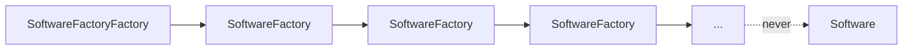

# SoftwareFactoryFactory

> **A software factory that builds software factories.**
> Software shipped: **0**. Factories shipped: **yes**.


[](https://ariel-frischer.github.io/SoftwareFactoryFactory/brag.mp4)
<p align="center"><a href="https://ariel-frischer.github.io/SoftwareFactoryFactory/brag.mp4">▶ Watch the launch video (22s, sound on)</a></p>

Everyone has a software factory now. Nobody has a software factory *factory*.
Until today.

## Install

```sh
go install github.com/ariel-frischer/SoftwareFactoryFactory@latest
SoftwareFactoryFactory
```

Press `q` (or Esc / Ctrl-C) to quit. The factories keep factoring without you.

Prebuilt binaries: [Releases](https://github.com/ariel-frischer/SoftwareFactoryFactory/releases). Live factory in your browser: **[ariel-frischer.github.io/SoftwareFactoryFactory](https://ariel-frischer.github.io/SoftwareFactoryFactory/)**.

## Features

- **Factorial growth.** Factory *n* multiplies the fleet by *n*. Factories factor in factorials, facilitating fantastically fractal fabrication.
- **Zero software.** Guaranteed by `TestShipsSoftware`, which fails if software ships.
- **Agentic.** Each factory has a planner agent. It is extremely confident.
- **Observable.** We write 4.2 GB of SQLite traces about our SQLite traces.
- **Enterprise-ready.** Our core interface is called `FactoryFactory`.

## Architecture



## FAQ

**Does it ship software?**
`SoftwareFactoryFactory --ship` exists. Try it.

**Why?**
Leverage on your prompt.

**Is this a joke?**
It's a factory.

## Roadmap

- [x] Q1: factory
- [x] Q2: factory factory
- [ ] Q3: you already know
- [ ] Q4: IPO

## Development

```sh
go test ./...        # proves no software ships
```
