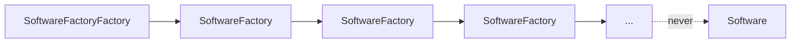

# SoftwareFactoryFactory

> **A software factory that builds software factories.**
> Software shipped: **0**. Factories shipped: **yes**.


Everyone has a software factory now. Nobody has a software factory *factory*.
Until today.

## Install

```sh
go install github.com/ariel-frischer/SoftwareFactoryFactory@latest
SoftwareFactoryFactory
```

Or open [`index.html`](index.html) in a browser. It runs the same factory, forever.

## Features

- **Factorial growth.** Factory *n* multiplies the fleet by *n*. Factories factor in factorials, facilitating fantastically fractal fabrication.
- **Zero software.** Guaranteed by `TestShipsSoftware`, which fails if software ships.
- **Agentic.** Each factory has a planner agent. It is extremely confident.
- **Observable.** We write 4.2 GB of SQLite traces about our SQLite traces.
- **Enterprise-ready.** Our core interface is called `FactoryFactory`.

## Architecture



## FAQ

**Does it ship software?**
`SoftwareFactoryFactory --ship` exists. Try it.

**Why?**
Leverage on your prompt.

**Is this a joke?**
It's a factory.

## Roadmap

- [x] Q1: factory
- [x] Q2: factory factory
- [ ] Q3: you already know
- [ ] Q4: IPO

## Development

```sh
go test ./...        # proves no software ships
vhs demo.tape        # re-render demo.gif
```

## License

MIT. Any factories your factories build are also MIT. So are theirs.
